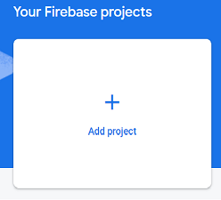
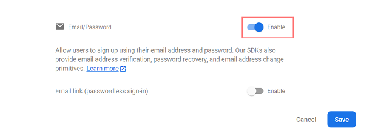
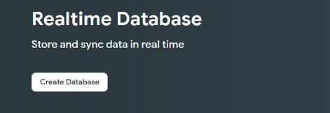
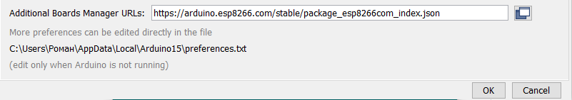
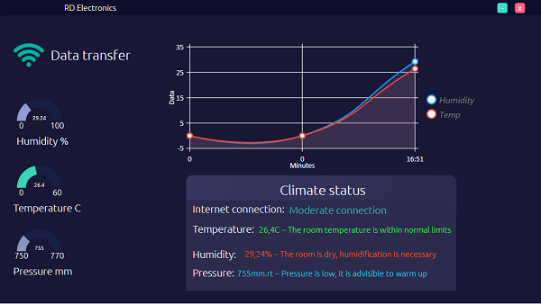

# RD-Climate


 Repository storing project for indoor climate control
## What is this project for?
*The project is designed to control the indoor climate in order to improve it*
## RD Climate Features:
+ Availability of a portable weather station.
+ Data exchange using FireBase.
+ Convenient and clear display of the obtained values.  
+ Providing simple tips and advice on climate stabilization.
___
## Instructions for launching the finished beta version:
1. Download the installer folder `RDClimate_Install`
2. Open the downloaded folder and run `Setup.exe`
3. Follow the installer's instructions
___
## Instructions for creating a weather station on your own and connecting it to a wpf application:
### To create a weather station you will need:
+ Controller `Wemos D1 mini`
+ Oled display `128x64`
+ Atmospheric pressure, humidity and temperature sensor `BME280`
#### Step 1 - Connecting:
+ Connect BME280 and Oled display to Wemos D1 mini as shown in the diagram below.

#### Step 2 - Creating a txt file:
 + Create a txt file into which you will copy the necessary keys and dependencies that will be used in the most
#### Step 3 Create FireBase account and Realtime Database:
1. You must have a google account
2. Go to site: https://firebase.google.com/
3. Click the `Get started` button 


4. Click the `Add project` button



5. Enter your project name


6. Click the `Continue` button
7. Select an account and click `Create project` button


8. When the creation of the project is completed, click on the `continue` button


9. Go to `Authentication` tab and click on the `Get started` button


10. Select the Option Email/Password


11. Enable that authentication method and click Save



12. On the Authentication tab, select the Users tab at the top. Then, click on Add User
13. Add an email address for the authorized user. It can be your google account email or any other email. You can also create an email for this specific project. Add a password that will allow you to sign in to your app and access the database. Don’t forget to save the email and password in your txt file. When you’re done, click Add user.


14. Go to `Realtime Database` tab and click on the `Сreate Database` button



15. Choose a database location and click `Next` button


16. Check the checkbox to `Start in locked mode` and click `Enable` button


17. Copy and save the database URL—highlighted in the following image into your txt file


18. In the Realtime Database panel, select the `Rules` tab and write the following rule:
```js
// These rules grant access to a node matching the authenticated
// user's ID from the Firebase auth token
{
  "rules": {
    "UsersData": {
      "$uid": {
        ".read": "$uid === auth.uid",
        ".write": "$uid === auth.uid"
      }
    }
  }
}
```
19. Click on the `Publish` button


20. On the left sidebar, click on Project Settings and copy the Web API Key to your txt file


#### Step 4 Wemos D1 mini firmware:
1. You must have the Arduino IDE installed, you can download it from the link: https://www.arduino.cc/en/software
2. Open the file `RD_Climate.ino` located in the folder `ESP8266/Frimware/RD_Climate`
3. Change project Wifi settings:
```C
// Insert your network credentials
#define WIFI_SSID "Insert the SSID of your WiFi network"
#define WIFI_PASSWORD "Paste the password for your WiFi network"
```
4. Change project FireBase settings take the data from your text file:
```C
// Insert Firebase project API Key
#define API_KEY "Paste the Api key of the FireBase project"
// Insert Authorized Email and Corresponding Password
#define USER_EMAIL "Insert trusted mail"
#define USER_PASSWORD "Insert trusted mail password"
// Insert RTDB URLefine the RTDB URL
#define DATABASE_URL "Provide a link to FireBase Realtime"
```
5. Сlick the `File` button, then the `Preferences` button, and in the `Additional Board Manager Links` box, put the following link `https://arduino.esp8266.com/stable/package_esp8266com_index.json` , then click OK



6. Install the necessary libraries in your Arduino environment, to do this, go to the `libraries` folder of your environment and copy the libraries from the `ESP8266/Libraries` folder into it.
7. Click the `tool` button, go to the `board` tab then select `ESP8266 Board`s then select `LOLIN(WEMOS) D1 R2 & mini`
8. Connect Wemos D1 mini to your computer with a micro usb cable, in the arduino environment, click the `tools` button, go to the `port` tab and select the port to which wemos d1 mini is connected
9. Click the `Upload` button and wait for it to complete.


10. Reconnect webos to your computer, go to the Realtime Database and copy the data path as shown in the image to your text file.


#### Step 5 Setting up a WPF Project:
1. To work with the project you will need Visual Studio, you can download it from this link: https://visualstudio.microsoft.com/ru/downloads/
2. Go to the `KeysConfiguration` folder and open the `KeysConfiguration.sln` file
3. Write down the necessary dependencies, take them in your txt file:
``` C#
public class AuthenticationKeys
    {
        public static string secretAuthKey = "Paste your unique identification key for FireBase";
        public static string firebasePath = "Paste Realtime Database Initialization Link";
        public static string dataPath = "Insert data path";
    }
```
4. Select the `Release` item in the Solution Configuration and press the keyboard shortcut `Ctrl+Shift+B` the library dll file will be generated
5. Right-click on the project solution and select `Open Folder in File Explorer`
6. Go to the `bin/Release` folder and copy the file `KeysConfiguration.dll` to the `RDClimate/Libraries` folder
7. Go to the `RDClimate` folder and open the `RDClimate.sln` file
8. Select the `Release` item in the Solution Configuration and click the Start button
9. You will see the RD Climate program running
10. Right-click on the project solution and select `Open Folder in File Explorer`
11. By going to the `bin` folder you can see the `Release` folder, which is the final build of the project that you copy.
12. By going to the `Release` folder, you can see the exe file that is the final assembled program, you can form a shortcut by sending the exe to the desktop.
___
#### Step 6 Housing for a weather station:
+ You can print the case for your weather station to a 3d printer using stl models from the `RD 3Dmodel` folder


#### Done



 Use and control your climate)
